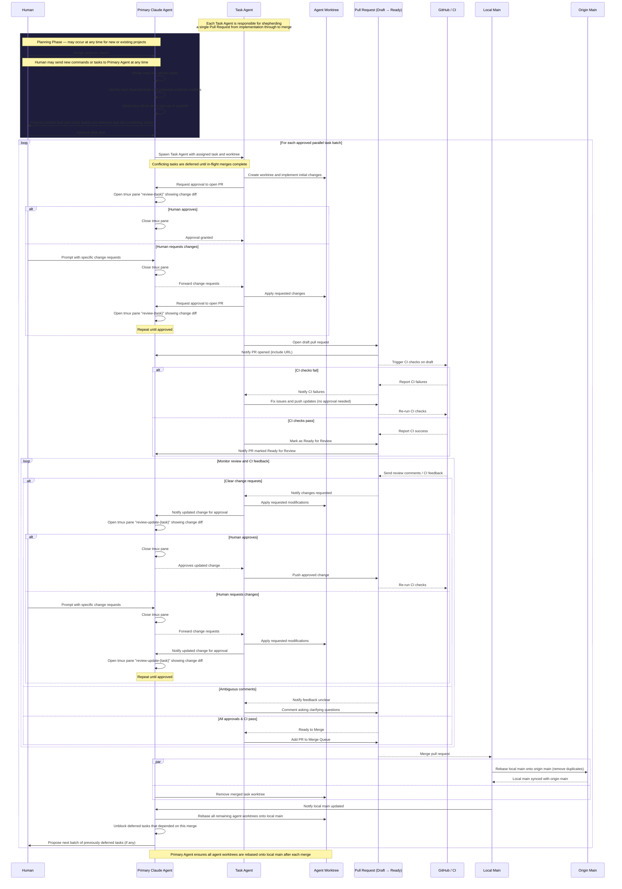

# Agent Workflow

```mermaid
sequenceDiagram
    participant Human as Human
    participant PrimaryAgent as Primary Claude Agent
    participant TaskAgent as Task Agent
    participant Worktree as Agent Worktree
    participant PR as Pull Request (Draft → Ready)
    participant GitHubCI as GitHub / CI
    participant LocalMain as Local Main
    participant OriginMain as Origin Main

    Note over TaskAgent: Each Task Agent is responsible for shepherding<br/>a single Pull Request from implementation through to merge

    rect rgb(30, 30, 60)
        Note over Human,PrimaryAgent: Planning Phase — may occur at any time for new or existing projects
        Human->>PrimaryAgent: Assign projects / tasks
        Note over Human,PrimaryAgent: Human may send new commands or tasks to Primary Agent at any time
        PrimaryAgent->>PrimaryAgent: Break work into atomic tasks
        PrimaryAgent->>PrimaryAgent: Identify task dependencies and potential worktree conflicts
        PrimaryAgent->>PrimaryAgent: Determine which tasks can run in parallel
        PrimaryAgent->>Human: Propose parallel task plan (safe tasks) and deferred task list (conflicting tasks)
        Human->>PrimaryAgent: Approve task plan
    end

    loop For each approved parallel task batch
        PrimaryAgent->>TaskAgent: Spawn Task Agent with assigned task and worktree
        Note over PrimaryAgent,TaskAgent: Conflicting tasks are deferred until in-flight merges complete

        TaskAgent->>Worktree: Create worktree and implement initial changes
        TaskAgent->>PrimaryAgent: Request approval to open PR
        PrimaryAgent->>PrimaryAgent: Open tmux pane "review-{task}" showing change diff
        alt Human approves
            PrimaryAgent->>PrimaryAgent: Close tmux pane
            PrimaryAgent-->>TaskAgent: Approval granted
        else Human requests changes
            Human->>PrimaryAgent: Prompt with specific change requests
            PrimaryAgent->>PrimaryAgent: Close tmux pane
            PrimaryAgent-->>TaskAgent: Forward change requests
            TaskAgent->>Worktree: Apply requested changes
            TaskAgent->>PrimaryAgent: Request approval to open PR
            PrimaryAgent->>PrimaryAgent: Open tmux pane "review-{task}" showing change diff
            Note over PrimaryAgent: Repeat until approved
        end

        TaskAgent->>PR: Open draft pull request
        PR->>PrimaryAgent: Notify PR opened (include URL)
        PR-->>GitHubCI: Trigger CI checks on draft

        alt CI checks fail
            GitHubCI-->>PR: Report CI failures
            PR-->>TaskAgent: Notify CI failures
            TaskAgent->>PR: Fix issues and push updates (no approval needed)
            PR-->>GitHubCI: Re-run CI checks
        else CI checks pass
            GitHubCI-->>PR: Report CI success
            TaskAgent->>PR: Mark as Ready for Review
            PR->>PrimaryAgent: Notify PR marked Ready for Review
        end

        loop Monitor review and CI feedback
            GitHubCI-->>PR: Send review comments / CI feedback
            alt Clear change requests
                PR-->>TaskAgent: Notify changes requested
                TaskAgent->>Worktree: Apply requested modifications
                TaskAgent->>PrimaryAgent: Notify updated change for approval
                PrimaryAgent->>PrimaryAgent: Open tmux pane "review-update-{task}" showing change diff
                alt Human approves
                    PrimaryAgent->>PrimaryAgent: Close tmux pane
                    PrimaryAgent-->>TaskAgent: Approves updated change
                    TaskAgent->>PR: Push approved change
                    PR-->>GitHubCI: Re-run CI checks
                else Human requests changes
                    Human->>PrimaryAgent: Prompt with specific change requests
                    PrimaryAgent->>PrimaryAgent: Close tmux pane
                    PrimaryAgent-->>TaskAgent: Forward change requests
                    TaskAgent->>Worktree: Apply requested modifications
                    TaskAgent->>PrimaryAgent: Notify updated change for approval
                    PrimaryAgent->>PrimaryAgent: Open tmux pane "review-update-{task}" showing change diff
                    Note over PrimaryAgent: Repeat until approved
                end
            else Ambiguous comments
                PR-->>TaskAgent: Notify feedback unclear
                TaskAgent->>PR: Comment asking clarifying questions
            else All approvals & CI pass
                PR-->>TaskAgent: Ready to Merge
                TaskAgent->>PR: Add PR to Merge Queue
            end
        end

        PR-->>LocalMain: Merge pull request
        par
            LocalMain->>OriginMain: Rebase local main onto origin main (remove duplicates)
            OriginMain-->>LocalMain: Local main synced with origin main
        and
            PrimaryAgent->>Worktree: Remove merged task worktree
        end
        LocalMain->>PrimaryAgent: Notify local main updated
        PrimaryAgent->>Worktree: Rebase all remaining agent worktrees onto local main
        PrimaryAgent->>PrimaryAgent: Unblock deferred tasks that depended on this merge
        PrimaryAgent->>Human: Propose next batch of previously deferred tasks (if any)
    end

    Note over PrimaryAgent,Worktree: Primary Agent ensures all agent worktrees are rebased onto local main after each merge
```

